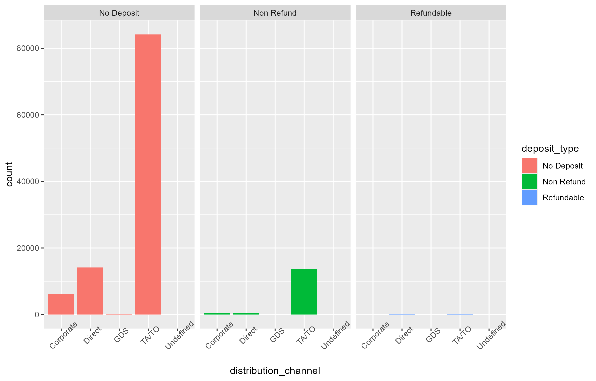
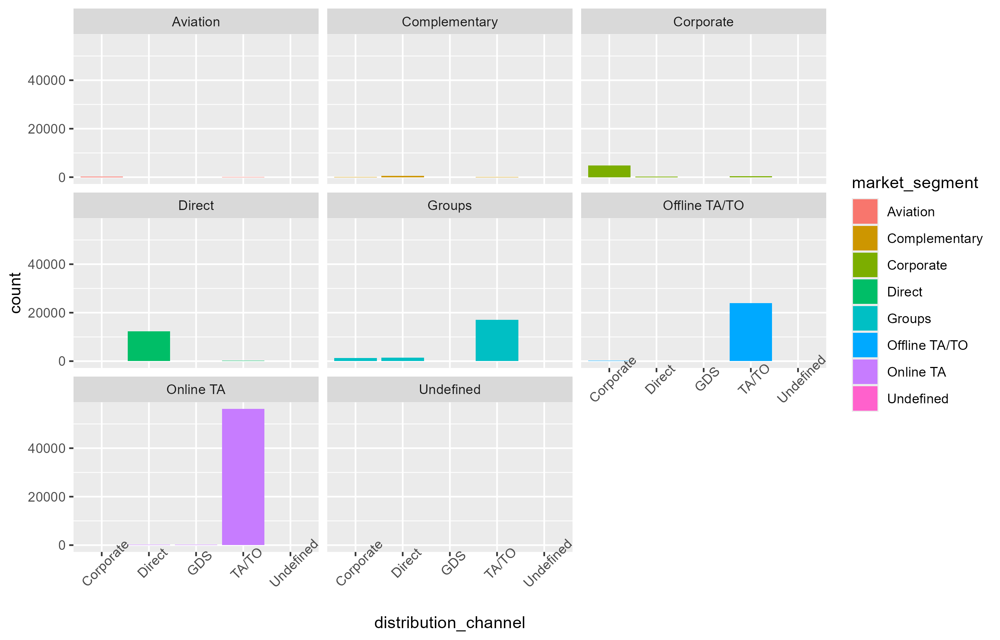
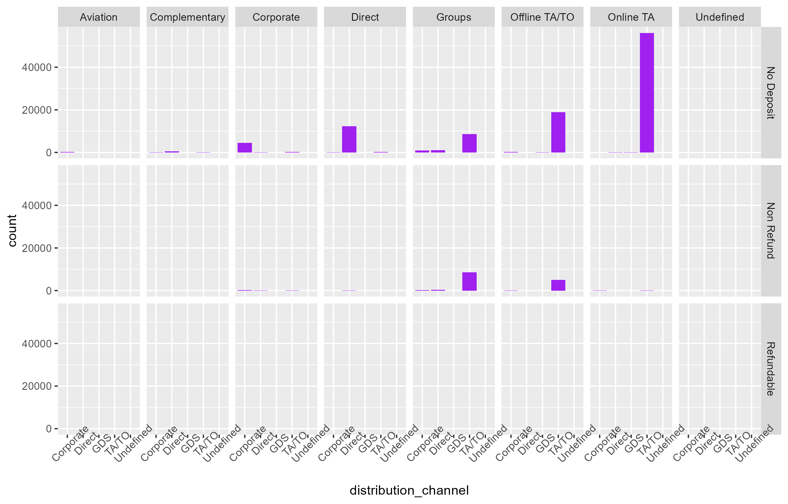

# Hotel Bookings Data Analysis with R

This project involves analyzing hotel bookings data to explore various distribution channels, market segments, and deposit types using data visualization techniques in R with the `ggplot2` package. The analysis focuses on understanding the relationships between these variables and how they impact hotel bookings.

## Table of Contents

- [Introduction](#introduction)
- [Dataset](#dataset)
- [Visualizations](#visualizations)
- [Results](#results)

## Introduction

In the hospitality industry, understanding booking patterns is essential for optimizing revenue and customer satisfaction. This project provides visual insights into the hotel bookings dataset by exploring:
- Distribution channels
- Deposit types
- Market segments

By visualizing these relationships, we can better understand customer behavior and preferences.

## Dataset

The dataset used for this analysis is named `hotel_bookings.csv`. **Please make sure to read the file before running the analysis code**. The dataset should be included in the repository.

- `hotel_bookings.csv`: Contains data on hotel bookings, including columns such as `distribution_channel`, `market_segment`, `deposit_type`, and other variables.

## Visualizations

This project uses the `ggplot2` package in R to create various bar plots to visualize the distribution of hotel bookings across different `distribution_channel`, `market_segment`, and `deposit_type` combinations. Below are the descriptions of the visualizations created:

1. **Distribution Channel by Deposit Type**  
   A bar plot showing the number of bookings made through each distribution channel (`direct`, `TA/TO`, `corporate`, etc.), filled by `deposit_type` (`No Deposit`, `Non Refund`, `Refundable`). This helps in understanding which deposit types are more common for each distribution channel.  
   

2. **Distribution Channel by Market Segment**  
   A bar plot illustrating the distribution of bookings across different distribution channels, segmented by `market_segment` (`Direct`, `Groups`, `Corporate`, etc.). This provides insights into which market segments prefer specific distribution channels.  
   

3. **Distribution Channel by Market Segment and Deposit Type**  
   A detailed bar plot using `facet_grid` to show the distribution of bookings across different distribution channels, segmented by both `market_segment` and `deposit_type`. This visualization allows for a deeper understanding of the relationships between these variables.  
   

These visualizations provide key insights into the booking patterns based on different channels, segments, and deposit preferences, helping hotel management in strategic decision-making.

## Results

From the analysis, we can derive several meaningful insights:

1. **Preference for Distribution Channels**:  
   The bar plots reveal distinct preferences for distribution channels among different market segments and deposit types. For instance, the `TA/TO` (Travel Agents/Tour Operators) channel is predominantly used by market segments like `Groups` with a higher proportion of `No Deposit` bookings.

2. **Impact of Deposit Type on Booking Channels**:  
   The facet-wrapped plots show that `Non Refundable` bookings are primarily channeled through specific distribution channels. This insight is vital for understanding customer risk preferences and optimizing pricing strategies.

3. **Market Segmentation and Channel Utilization**:  
   The visualizations suggest that certain market segments, such as `Corporate` or `Groups`, tend to use specific booking channels more frequently than others. This information can be useful for targeted marketing and partnership strategies.

4. **Strategic Insights for Hotel Management**:  
   By combining these visualizations, hotel management can identify which distribution channels yield the highest bookings for specific market segments and deposit types. This understanding can guide promotional campaigns, channel partnerships, and inventory management.

Overall, these analyses enable hoteliers to optimize their distribution strategies, enhance revenue management, and improve customer satisfaction by aligning with market preferences.
